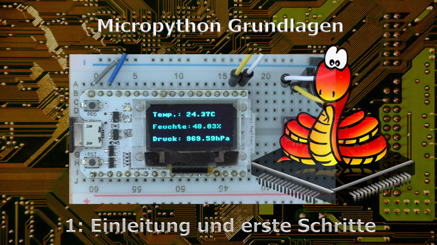
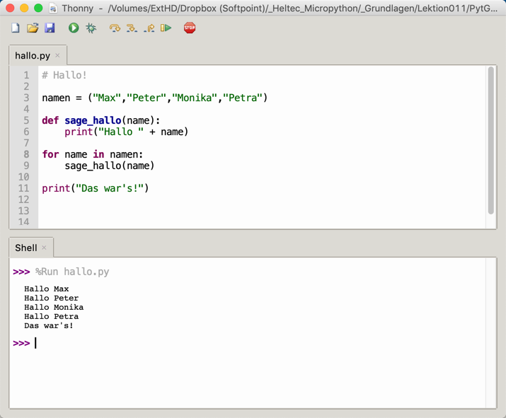
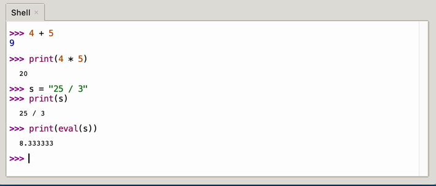

.. Micropython Grundlagen Kapitel 1, created by
   sphinx-quickstart on Sat Oct 26 11:55:18 2019.
   You can adapt this file completely to your liking, but it should at least
   contain the root `toctree` directive.

   

1: Erste Schritte, Sprachstruktur, interaktive Konsole
======================================================

   Das Video zu dieser Lektion    

Lade auch das `Begleitmaterial <https://www.hobbyelektroniker.ch/resources/PytGr1.zip>`_ . Es wird dich bei deinen Versuchen unterstützen!

Erste Schritte
----------------

Das erste Programm ist sehr einfach. Erzeuge in Thonny ein neues Dokument und speichere es unter dem Namen *hallo.py* auf deiner Festplatte ab. Du kannst es aber auch direkt aus dem `Begleitmaterial <https://www.hobbyelektroniker.ch/resources/PytGr1.zip>`_ laden.
Achte beim Abschreiben auf Gross- und Kleinschreibung. Das Einrücken nach dem : macht Thonny selbstständig. Du solltest das so lassen, da sonst das Programm nicht mehr läuft.

   Die Thonny Entwicklungsumgebung

Es ist nicht notwendig, dass du das Programm vor der Ausführung auf dein Board speicherst.
Ausführen kannst du das Programm durch Drücken auf den grünen Pfeil. |button_reference|

Die Sprachstruktur
------------------

Dieses Beispiel gibt und die Gelegenheit einen ersten Blick auf die Sprachstruktur von Micropython zu werfen. Im Wesentlichen handelt es sich um Python 3. Da Mikrocontroller aber wesentlich weniger Speicher und Leistung besitzen als Desktopcomputer, wurden einige Anpassungen vorgenommen.
Detaillierte Informationen findest du auf der Webseite von Micropython.

Selbstverständlich unterstützt auch Micropython Kommentare. Diese werden hier mit # eingeleitet. 
Variablen werden durch Zuweisung eines Wertes angelegt. Dadurch erhalten sie auch gleich ihren Typ.

.. code-block:: python

   # Das ist die Liste mit den Namen
   namen = ("Max","Peter","Monika","Petra")

Als Nächsten finden wir eine Funktionsdefinition. Hier fällt der : und die Einrückung danach auf. Mit : starten wir einen Block ( in C wäre das { ). Der Block bleibt solange bestehen, wie wir die Einrückung beibehalten. 

.. code-block:: python

   def sage_hallo(name):
      print("Hallo " + name)

Ausserhalb des Blocks geht es mit 

.. code-block:: python

   for name in namen:
      sage_hallo(name)

weiter. Auch hier haben wir einen Block.

Das Ganze beenden wir mit dem Schlusssatz. 

.. code-block:: python

   print("Das war's!")

**In Python wird normalerweise nur ein Befehl pro Zeile geschrieben. Der Befehl muss auch nicht mit ; abgeschlossen werden.**

REPL, die interaktive Konsole
-----------------------------

REPL steht für read-evaluate-print loop. Diese Konsole kann Befehle entgegennehmen, ausführen und Ergebnisse ausgeben.

Python ist eine interpretierte Sprache. Wir können jeden Befehl direkt eingeben und ausführen lassen. Es ist nicht notwendig, die Befehle zuerst in Maschinensprache zu übersetzen.

Hier einige Beispiele:

