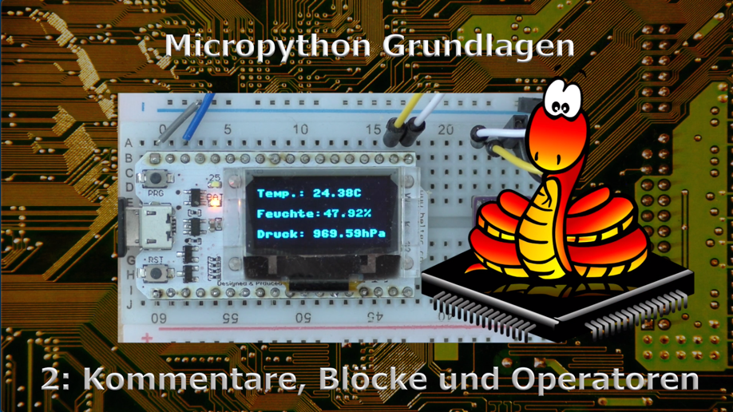

.. Micropython Grundlagen Kapitel 2, created by
   sphinx-quickstart on Sat Oct 26 11:55:18 2019.
   You can adapt this file completely to your liking, but it should at least
   contain the root `toctree` directive.

2: Kommentare, Blöcke und Operatoren
====================================

   Das Video zu dieser Lektion

Lade auch das `Begleitmaterial <https://www.hobbyelektroniker.ch/resources/PytGr2.zip>`_ . Es wird dich bei deinen Versuchen unterstützen!

.. raw:: html

  <iframe width="560" height="315" src="https://www.youtube.com/embed/c-tpY-HNYig" frameborder="0" allow="accelerometer; autoplay; encrypted-media; gyroscope; picture-in-picture" allowfullscreen></iframe>

Kommentare
----------

In jedem Programm sind erläuternde Kommentare wichtig. Nur so weiss man nach Jahren noch, was man sich damals dabei gedacht hat.

Es gibt einfache Kommentare, die immer mit # eingeleitet werden. Sie beginnen mit # und enden mit dem Zeilenende. 

.. code-block:: python

   a = 5  # Die Variable a wird auf 5 gesetzt

Mehrzeilige Kommentare werden mit ``"""`` oder ``'''`` eingeleitet. Sie werden mit derselben Zeichenfolge beendet. 

.. code-block:: python

   """
   erste Kommentarzeile
   zweite Kommentarzeile
   """

oder 

.. code-block:: python

   '''
   erste Kommentarzeile
   zweite Kommentarzeile
   '''

Blöcke
------

In der Sprache C werden Blöcke bekanntlich in { } eingeschlossen. Python verwendet hier ein etwas anderes Konzept. Einrückungen, die in C nur der Übersichtlichkeit dienen, sind in Python Bestandteil der Syntax und helfen Blöcke zu definieren.

.. code-block:: python

   def addiere(a,b):    # Mit dem : wird der Block eingeleitet
      c = a + b         # Nach dem : wird eingerückt
      print(c)          # Diese Einrückung bleibt für alle Befehle
                        # innerhalb des Blockes erhalten

   addiere(3,5)         # Keine Einrückung mehr! Damit gehört dieser Befehl
                        # nicht mehr zum Block

In Bedingungen und Schleifen werden Blöcke auf identische Art gebildet.

Operatoren
----------

**Arithmetische Operatoren**

+-----+----------------------------+---------------+
| \+  | Addition                   | c = a + b     |
+-----+----------------------------+---------------+
| \-  | Subtraktion                | c = a - b     |
+-----+----------------------------+---------------+
| \*  | Multiplikation             | c = a * b     |
+-----+----------------------------+---------------+
| /   | Division                   | c = a / b     |
+-----+----------------------------+---------------+
| //  | Ganzzahlige Division       | 11 // 3 ==> 3 |
+-----+----------------------------+---------------+
| %   | Modulo (Rest der Division) | 11 % 3 ==> 2  |
+-----+----------------------------+---------------+
| \** | Exponent                   | 2 ** 3 ==> 8  |
+-----+----------------------------+---------------+

**Logische Operatoren**

+--------------+---------------------+
| and, or, not | Boolsche Operatoren |
+--------------+---------------------+

**Bitoperatoren**

+----+------------------------------+
| &  | Bitweise AND - Operation     |
+----+------------------------------+
| \| | Bitweise OR - Operation      |
+----+------------------------------+
| ^  | Bitweise XOR - Operation     |
+----+------------------------------+
| ~  | Bitweises NOT                |
+----+------------------------------+
| << | Bits nach links verschieben  |
+----+------------------------------+
| >> | Bits nach rechts verschieben |
+----+------------------------------+

**Vergleichsoperatoren**

+--------+------------------------+---------------------------------+
| ==     | ist gleich             | 3 == 5 ==> False                |
+--------+------------------------+---------------------------------+
| !=     | ist ungleich           | 3 != 5 ==> True                 |
+--------+------------------------+---------------------------------+
| >      | grösser                | 3 > 5 ==> False                 |
+--------+------------------------+---------------------------------+
| <      | kleiner                | 3 < 5 ==> True                  |
+--------+------------------------+---------------------------------+
| <=     | kleiner oder gleich    |                                 |
+--------+------------------------+---------------------------------+
| >=     | grösser oder gleich    |                                 |
+--------+------------------------+---------------------------------+
| in     | ist enthalten in       | "Max" in ("Max", "Peter")       |
+--------+------------------------+---------------------------------+
| not in | ist nicht enthalten in | "Fritz" not in ("Max", "Peter") |
+--------+------------------------+---------------------------------+

 