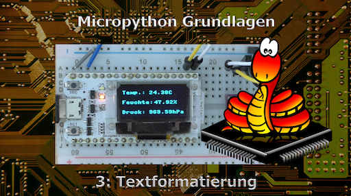

.. Micropython Grundlagen Kapitel 3, created by
   sphinx-quickstart on Sat Oct 26 11:55:18 2019.
   You can adapt this file completely to your liking, but it should at least
   contain the root `toctree` directive.

3: Textformatierung
===================

   Das Video zu dieser Lektion

   
Lade auch das `Begleitmaterial <https://www.hobbyelektroniker.ch/resources/PytGr3.zip>`_ . Es wird dich bei deinen Versuchen unterstützen!

In vielen Projekten werden Texte ausgegeben. Das ist einfach, solange sie nicht formatiert sein müssen. In der Realität benötigen wir aber oft zum Beispiel rechtsbündig angeordnete Zahlen, Texte mit fester Länge oder Zahlen mit Vornullen oder einer bestimmten Anzahl Stellen nach dem Komma. Wir erwarten aber auch, dass das Ganze einfach zu programmieren ist.

Python liefert uns hier viele komfortable Lösungen. Die Wichtigsten schauen wir uns jetzt an.

Einfache Textausgabe mit Platzhalter
------------------------------------

Die einfachste Art der Textausgabe::

	print("Das ist ein String")

Das muss ich wohl nicht mehr näher erläutern.

Wenn ich in einen Text einen anderen Text oder eine Zahl einbetten möchte, brauche ich einen Platzhalter. Dieser wird durch ein geschweiftes Klammernpaar {} gebildet.
Jeder String kann durch den Format - Befehl erweitert werden. Dabei wird im Text an allen Stellen, in denen etwas eingefügt werden soll, ein {} geschrieben. Im Format - Befehl werden dann einfach die Werte in der richtigen Reihenfolge angegeben.

.. code-block:: python

	rechnung = "3 * 5"
	print("Das Resultat von {} ist {}".format(rechnung,3*5))

	---
	Das Resultat von 3 * 5 ist 15

Was ist jetzt aber, wenn ich {} in meinem Text wirklich schreiben möchte? Hier zwei Möglichkeiten:

.. code-block:: python

	print("In der Sprache {} werden Blöcke in {{}} eingeschlossen.".format("C"))

	---
	In der Sprache C werden Blöcke in {} eingeschlossen.

	text = "In der Sprache {} werden Blöcke in {} eingeschlossen."
	print(text.format("C","{}"))
	print(text.format("Pascal","begin end"))

	---
	In der Sprache C werden Blöcke in {} eingeschlossen.
	In der Sprache Pascal werden Blöcke in begin end eingeschlossen.

Die Feldlänge kann ebenfalls angegeben werden. Ausserdem können wir den Text links- oder rechtsbündig oder eingemittet ausgeben. Dazu verwenden wir : als Einleitung der Formatierung.

.. code-block:: python

	text = "Für {:10} brauchen wir viel Platz."
	print(text.format("HALLO"))

	text = "Für {:<10} brauchen wir viel Platz."
	print(text.format("HALLO"))

	text = "Für {:>10} brauchen wir viel Platz."
	print(text.format("HALLO"))

	text = "Für {:^10} brauchen wir viel Platz."
	print(text.format("HALLO"))

	---
	Für HALLO      brauchen wir viel Platz.
	Für HALLO      brauchen wir viel Platz.
	Für      HALLO brauchen wir viel Platz.
	Für   HALLO    brauchen wir viel Platz.

Ganze Zahlen
------------

Ich habe hier eine Liste von ganzen Zahlen und möchte diese mit einem nachfolgenden Text ausgeben. ::

	zahlen = [2,235,15,8,-12]
	ausgabe = "Die Zahl ist {}, was kommt danach?"
	for zahl in zahlen:
	    print(ausgabe.format(zahl))

	---
	Die Zahl ist 2, was kommt danach
	Die Zahl ist 235, was kommt danach
	Die Zahl ist 15, was kommt danach
	Die Zahl ist 8, was kommt danach
	Die Zahl ist -12, was kommt danach
    

Oft wird aber gewünscht, dass der nachfolgende Text schön untereinander dargestellt wird. Dazu müssen wir für die Zahlenausgabe eine fixe Länge definieren.

Der Platzhalter wird dazu mit : erweitert, danach geben wir die Länge an und setzen den Datentyp mit dem Buchstaben d auf eine ganze Zahl.

.. code-block:: python

	zahlen = [2,235,15,8,-12]
	ausgabe = "Die Zahl ist {:4d}, was kommt danach?"
	for zahl in zahlen:
		print(ausgabe.format(zahl))

	----
	Die Zahl ist    2, was kommt danach
	Die Zahl ist  235, was kommt danach
	Die Zahl ist   15, was kommt danach
	Die Zahl ist    8, was kommt danach
	Die Zahl ist  -12, was kommt danach

Zahlen werden automatisch rechtsbündig ausgegeben. Das kann aber ebenfalls gesteuert werden.

| Linksbündig: 	``{:<4d}``
| Rechtsbündig: 	``{:>4d}``
| Zentriert: 		``{:^4d}``

Weitere Optionen:

| Vorzeichen immer ausgeben: 				``{:+4d}``
| Vornullen und Vorzeichen: 				``{:+04d}``
| Vorzeichen untereinander: 				``{: =+4d}``
| Vorzeichen untereinander und Vornullen: ``{:0=+4d}``

